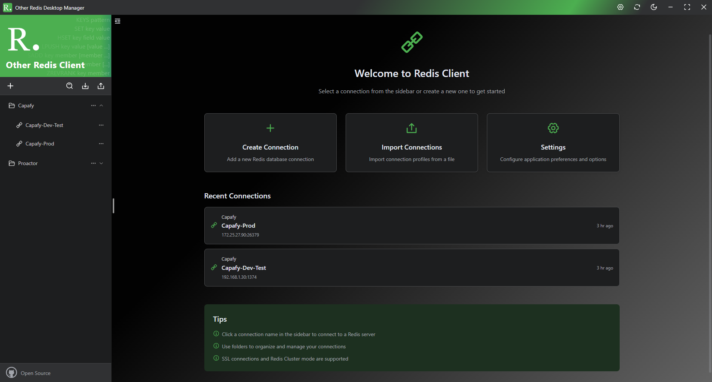
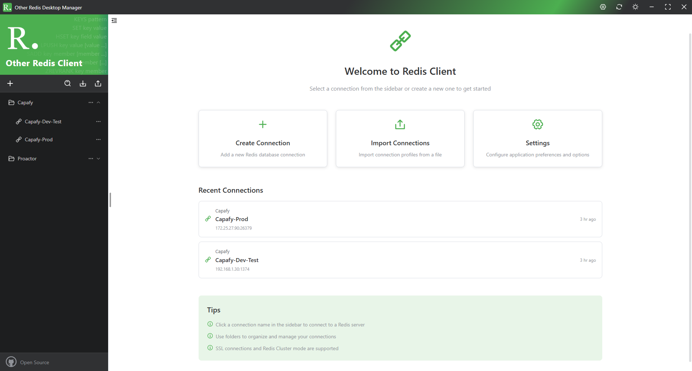
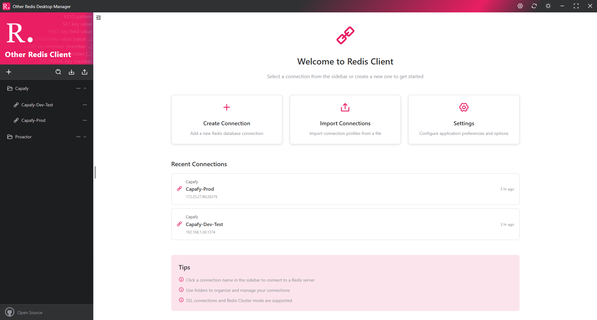
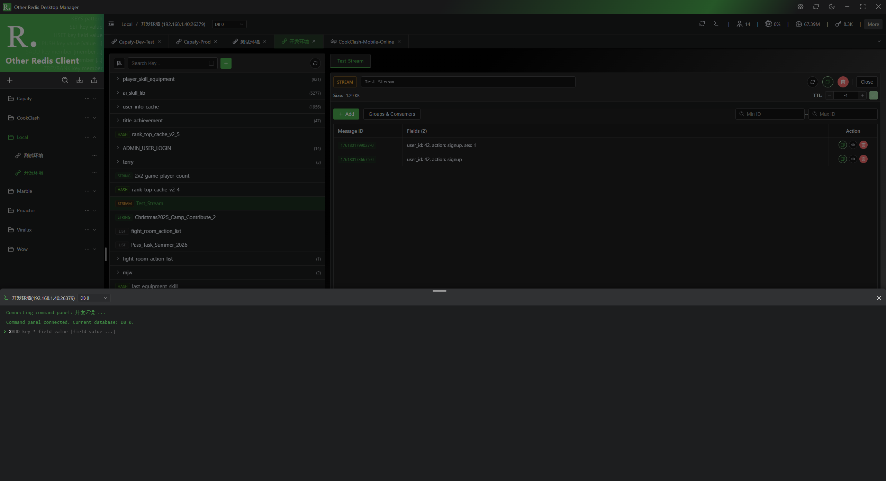
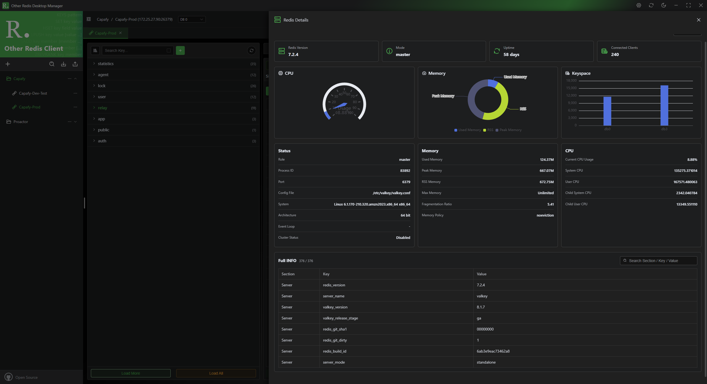
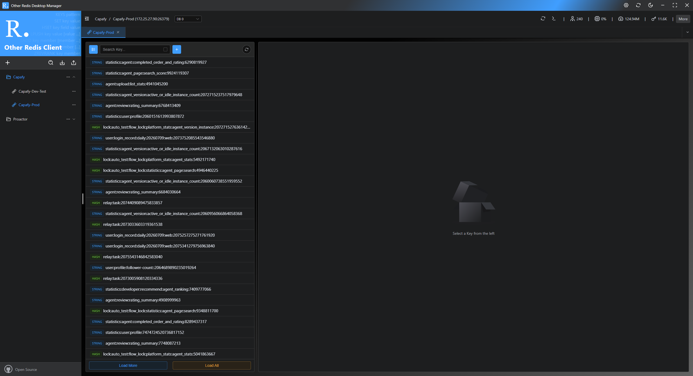
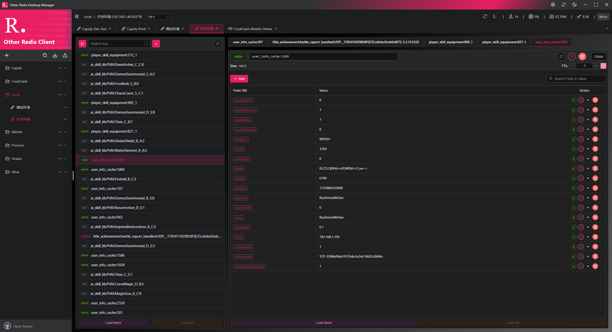
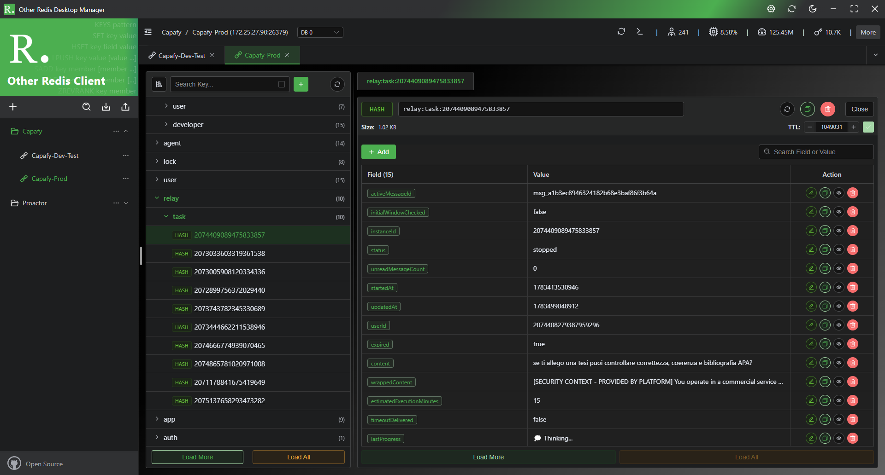

# Other Redis Desktop Manager

<p align="center">
  
</p>

<p align="center">
  A modern Redis desktop client built with Vue 3, Element Plus, and Electron.
</p>

<p align="center">
  <a href="README.md">English</a> | <a href="README.zh-CN.md">简体中文</a>
</p>

<p align="center">
  
  
  
  
  
</p>

Other Redis Desktop Manager focuses on everyday Redis data management. It provides connection management, key browsing, key detail editing, a command drawer, Redis server information, theme switching, basic internationalization, and update checking in a polished desktop experience.

## Preview

### Welcome and Connections

<p align="center">
  
</p>

<p align="center">
  
</p>

### Theme Colors

<p align="center">
  
</p>

### Key Browser and Command Drawer

<p align="center">
  
</p>

### Redis Server Information

<p align="center">
  
</p>

### Key List and Details

<p align="center">
  
</p>

<p align="center">
  
</p>

<p align="center">
  
</p>

## Features

- Connection management: create, edit, delete, move, group, import, export, and test Redis connections.
- Redis modes: supports standalone Redis, Sentinel configuration, and Cluster configuration.
- Key browsing: dynamic DB list, DB size display, SCAN pagination, load more, load all, list view, tree view, and virtualized rendering.
- Key details: separated detail panels for String, Hash, List, Set, ZSet, and Stream.
- Data operations: view, copy, add, edit, delete, rename, update TTL, and delete keys for common Redis data types.
- Command drawer: runs commands through an independent Redis connection with DB selection, command history, examples, and result display.
- Redis information: server status, memory usage, CPU data, keyspace charts, and full INFO table with search.
- Desktop experience: dark and light themes, theme color switching, tray support, custom window controls, internationalization, and update checking.
- Engineering structure: clear main / preload / renderer boundaries with Pinia, Dexie, ioredis, ECharts, and electron-builder.

## Tech Stack

| Area | Technology |
| --- | --- |
| Desktop shell | Electron |
| Frontend framework | Vue 3 |
| UI components | Element Plus |
| State management | Pinia |
| Local storage | Dexie / IndexedDB |
| Redis client | ioredis |
| Charts | ECharts |
| Build tool | Vite |
| Icons | @icon-park/vue-next |
| Packaging | electron-builder |

## Project Structure

```text
src
├── main                 # Electron main process: windows, tray, IPC, Redis connection management
├── preload              # Minimal APIs exposed safely to the renderer process
└── renderer             # Vue renderer process
    ├── assets           # Global styles and static assets
    ├── components       # Page components, dialogs, drawers, and key detail components
    ├── database         # IndexedDB models and repositories
    ├── i18n             # Internationalization messages
    ├── router           # Vue Router
    ├── stores           # Pinia stores
    ├── utils            # Renderer utility functions
    └── views            # Top-level views
```

## Development

Install dependencies:

```bash
npm install
```

Start the renderer development server:

```bash
npm run dev:renderer
```

Start the Electron main process:

```bash
npm run dev:main
```

During development, you usually need two terminal windows: one for `dev:renderer` and one for `dev:main`.

## Build and Package

Build renderer assets only:

```bash
npm run build
```

Verify the Electron packaging configuration without producing an installer:

```bash
npm run pack
```

This creates an unpacked application directory:

```text
release/win-unpacked
```

Build the Windows installer and portable executable:

```bash
npm run dist:win
```

Build macOS packages on a Mac:

```bash
CSC_IDENTITY_AUTO_DISCOVERY=false npm run dist:mac
```

Build Apple Silicon or Intel packages separately:

```bash
CSC_IDENTITY_AUTO_DISCOVERY=false npm run dist:mac:arm64
CSC_IDENTITY_AUTO_DISCOVERY=false npm run dist:mac:x64
```

`CSC_IDENTITY_AUTO_DISCOVERY=false` disables automatic certificate discovery for this build command. This project can be packaged without an Apple Developer account, but macOS Gatekeeper may still show a security prompt after users download the app from GitHub.

Artifacts are generated in:

```text
release
```

Typical Windows outputs:

```text
release/Other Redis Desktop Manager-Setup-1.0.2-x64.exe
release/Other Redis Desktop Manager-Portable-1.0.2-x64.exe
```

- `Setup`: NSIS installer. Install it before use.
- `Portable`: portable executable. Run it directly.
- `.blockmap`: a differential update metadata file generated by electron-builder. It is not an executable for end users.

Recommended macOS distribution:

- Upload the generated `.zip` package to GitHub Releases first. The `.dmg` package can also be uploaded as an alternative.
- If macOS shows “cannot verify the developer”, open System Settings -> Privacy & Security, then click “Open Anyway”.
- A fully silent macOS launch requires Apple Developer ID signing and notarization.

If Electron download fails or files under `node_modules/electron` are locked, check that:

1. The running Electron app has been closed.
2. No terminal, antivirus software, or file explorer window is locking files under `node_modules/electron`.
3. Your network is stable. If needed, configure an Electron download mirror and retry.

## Repository

- GitHub: [mutolee/other-redis-desktop-manager](https://github.com/mutolee/other-redis-desktop-manager)

## License

See [LICENSE](LICENSE).
